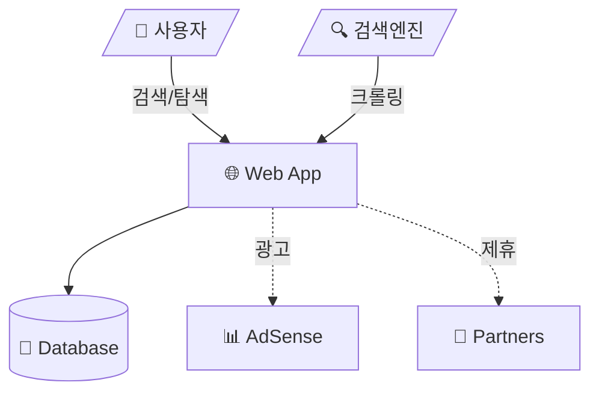
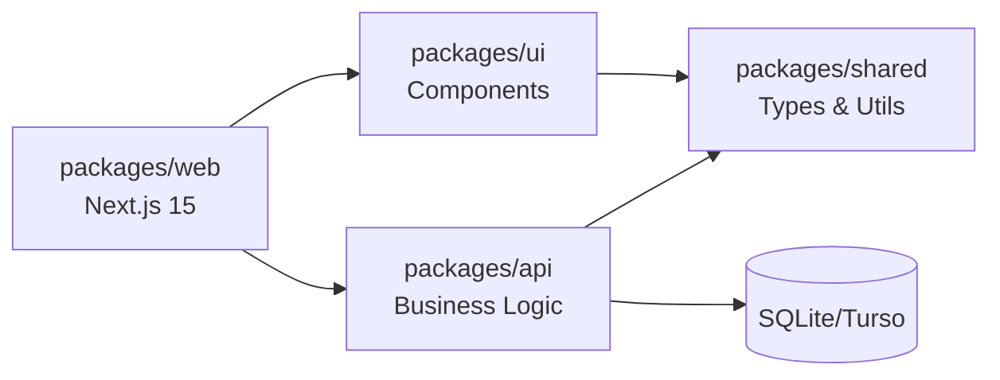

# Architecture Overview

## 시스템 개요
AI Tool Directory는 AI 도구를 카테고리별로 정리하고 SEO 최적화된 페이지를 제공하여 검색 트래픽 기반 수익을 창출하는 웹 애플리케이션이다.

## 아키텍처 원칙
1. **모노레포 + 패키지 분리**: 단일 저장소에서 관심사별 패키지 분리
2. **점진적 마이크로서비스**: MVP는 모놀리식 배포, 향후 서비스 분리 가능 구조
3. **SEO 우선**: SSG/ISR로 정적 페이지 생성, 검색엔진 최적화
4. **제로 비용 MVP**: 무료 tier만으로 운영 가능한 인프라

## 시스템 컨텍스트

[전체 다이어그램: system-context.mmd](./system-context.mmd)

## 컨테이너 구조

[전체 다이어그램: container-diagram.mmd](./container-diagram.mmd)

## 패키지 역할

| 패키지 | 역할 | 기술 |
|--------|------|------|
| `packages/web` | 프론트엔드 + API Routes | Next.js 15, App Router |
| `packages/api` | 비즈니스 로직, DB 접근 | Drizzle ORM, SQLite |
| `packages/shared` | 공통 타입, 유틸리티 | TypeScript |
| `packages/ui` | 재사용 UI 컴포넌트 | React, Tailwind, shadcn |

## 데이터 흐름
[전체 다이어그램: data-flow.mmd](./data-flow.mmd)

### 핵심 흐름
1. **SEO 흐름**: 검색엔진 → 크롤링 → SSG 페이지 → 인덱싱
2. **사용자 탐색**: 방문 → 홈/카테고리/검색 → 도구 상세 → Affiliate 클릭
3. **검색 흐름**: 검색어 → API → FTS 쿼리 → 결과 목록
4. **수익 흐름**: 페이지뷰 → AdSense 노출 + Affiliate 클릭 → 수익

## 배포 아키텍처
[전체 다이어그램: deployment.mmd](./deployment.mmd)

### 환경
| 환경 | 인프라 | DB |
|------|--------|-----|
| 개발 | 로컬 (pnpm dev) | SQLite (local.db) |
| 프로덕션 | Vercel (Edge + Serverless) | Turso (LibSQL Cloud) |

## 기술 스택 요약

| 레이어 | 기술 | 버전 |
|--------|------|------|
| Framework | Next.js | 15.x |
| Language | TypeScript | 5.x |
| ORM | Drizzle | 0.38+ |
| DB | SQLite → Turso | - |
| UI | Tailwind + shadcn/ui | 4.x |
| Build | Turborepo | 2.x |
| Test | Vitest + Playwright | 3.x / 1.50+ |
| Deploy | Vercel | - |
| Monorepo | pnpm workspaces | 10.x |

## 확장 경로
1. **Phase 1 (MVP)**: 모놀리식, SQLite, Vercel
2. **Phase 2**: Turso 전환, ISR 최적화, Analytics
3. **Phase 3**: 독립 API 서비스, Redis 캐시, 검색 고도화
4. **Phase 4**: AI 자동 수집, 콘텐츠 자동 생성
